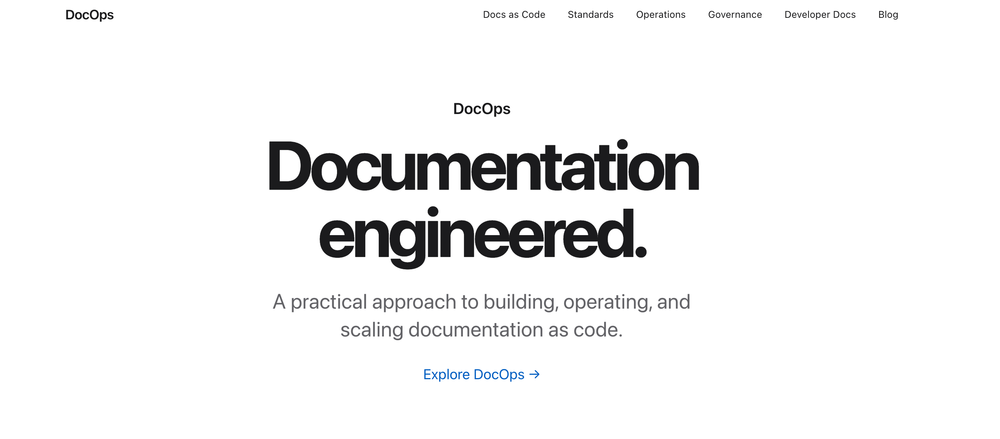

# DocOps

**Documentation engineered.**

A practical approach to building, operating, and scaling documentation as code.

**[View DocOps live →](https://hollyabrams.github.io/docops/)**

DocOps is an open-source demonstration of documentation engineering in practice—a working environment for exploring how documentation can be built, operated, tested, governed, and maintained like software.



## About the project

Documentation is more than content.

Modern documentation teams work with source control, automated validation, structured content, APIs, CI/CD pipelines, governance models, and measurable quality standards.

DocOps demonstrates those practices in a working Next.js application rather than simply describing them.

The project explores the complete documentation lifecycle:

**Intake → Draft → Review → Validate → Publish → Maintain**

## What DocOps demonstrates

- Docs-as-code workflows
- Documentation standards and style guidance
- Documentation operations and governance
- API documentation and OpenAPI
- Content lifecycle management
- Automated documentation validation
- Documentation health checks
- CI/CD for documentation
- Developer documentation
- Documentation engineering practices

## Technology

DocOps is built with:

- Next.js
- React
- TypeScript
- SCSS
- MDX
- OpenAPI
- GitHub Actions

Additional documentation tooling and automated validation will be added as the project evolves.

## Local development

Install dependencies:

```bash
npm install
```

Start the development server:

```bash
just run
```

Or:

```bash
npm run dev
```

Open `http://localhost:3000`.

## Project status

DocOps is actively being developed.

The initial release establishes the application shell, visual system, documentation architecture, and documentation lifecycle model. Future iterations will add working documentation content, API examples, automated validation, documentation health metrics, and CI/CD workflows.

## Author

Designed and engineered by **Holly Abrams**.

- [Portfolio](https://hollyabrams.github.io/portfolio/)
- [LinkedIn](https://www.linkedin.com/in/hollyabrams/)
- [GitHub](https://github.com/hollyabrams)
